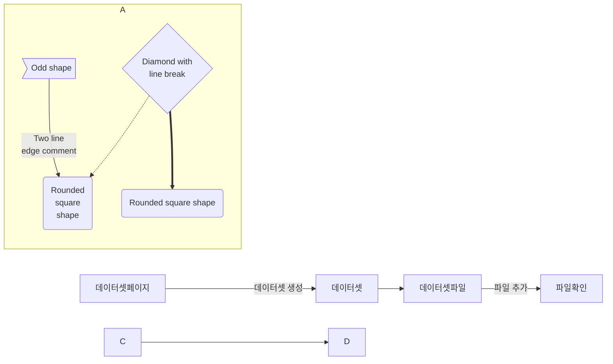
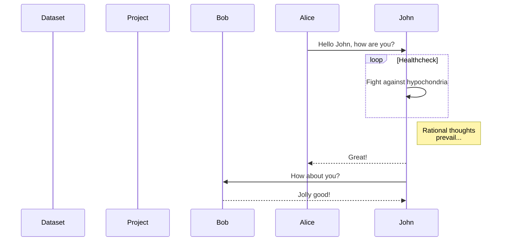
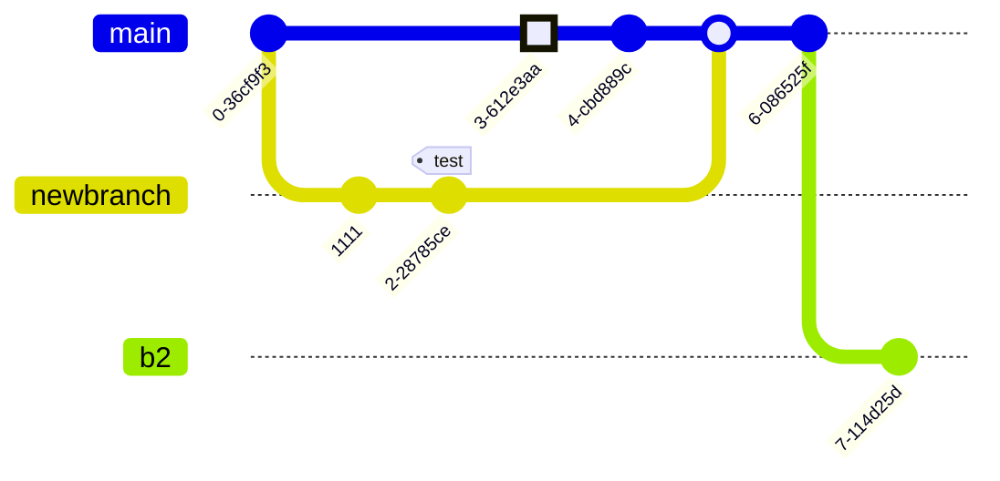

# 메뉴 구조 및 주요 용어

> 이것은 설명입니다.

## 메뉴 구조

```
다음의 4개 메뉴로 구성되어있습니다.
```


### Datasets


```mermaid
graph LR;
    데이터셋페이지-->|데이터셋 생성|데이터셋-->데이터셋파일-->|파일 추가|파일확인;
    subgraph A
        od>Odd shape]-- Two line<br/>edge comment --> ro
        di{Diamond with <br/> line break} -.-> ro(Rounded<br>square<br>shape)
        di==>ro2(Rounded square shape)
    end

    C-->D;
```


```mermaid
sequenceDiagram
    participant Dataset
    participant Project
    participant Project
    participant Bob
    Alice->>John: Hello John, how are you?
    loop Healthcheck
        John->>John: Fight against hypochondria
    end
    Note right of John: Rational thoughts<br/>prevail...
    John-->>Alice: Great!
    John->>Bob: How about you?
    Bob-->>John: Jolly good!
```


```mermaid
gitGraph:
    commit "Ashish"
    branch newbranch
    checkout newbranch
    commit id:"1111"
    commit tag:"test"
    checkout main
    commit type: HIGHLIGHT
    commit
    merge newbranch
    commit
    branch b2
    commit
```
